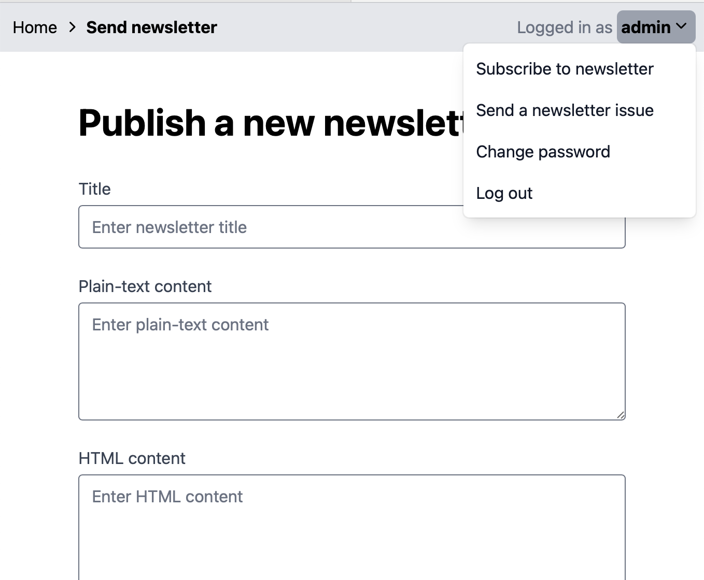

# Newsletter app

Sample implementation of the application project from [Zero To Production In Rust](https://zero2prod.com), with custom frontend code.

After finishing the exercises in the book, I added on to the implementation with a custom frontend, implemented with Vue and Tailwind.

Note that this repo differs from [Luca Palmieri's reference implementation](https://github.com/LukeMathWalker/zero-to-production), although occasional code snippets were copied from that implementation.

## How to deploy
This application is designed to be hosted on DigitalOcean App Platform.

To deploy, use `doctl create` with `spec.yaml`.

### Additional environment variables
To run the application, additional environment variables must be set for the app on App Platform. The following variables must be set with secrets from your own app instance:

```
APP_REDIS_URI
APP_DATABASE__DATABASE_NAME
APP_DATABASE__HOST
APP_DATABASE__PORT
APP_DATABASE__USERNAME
APP_DATABASE__PASSWORD
```

This variable must be set using your API token from Postmark:

```
APP_EMAIL_CLIENT__AUTHORIZATION_TOKEN
```

This variable is recommended:

```
RUST_BACKTRACE=full
```

And finally this must be set:

```
APP_ENVIRONMENT=production
```


## Screenshots




## Troubleshooting

### `"Too many open files"`

Problem:
```
thread 'subscriptions_confirm::confirm_returns_500_if_token_is_invalid' panicked at backend/tests/api/subscriptions_confirm.rs:88:48:
Failed building the Runtime: Os { code: 24, kind: Uncategorized, message: "Too many open files" }
```

Solution:
```
ulimit -n 10240
```
